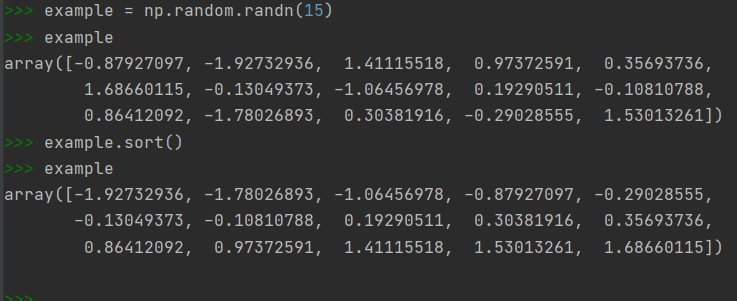
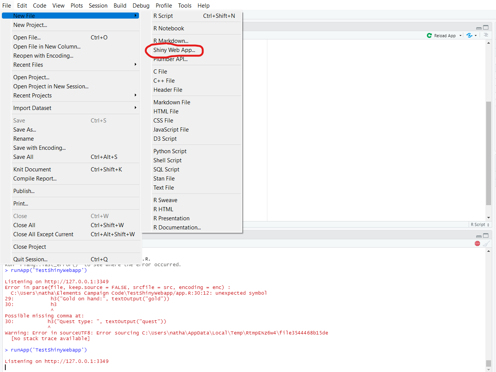
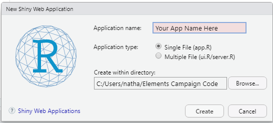
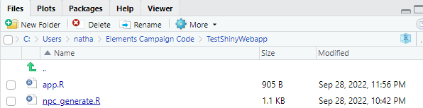
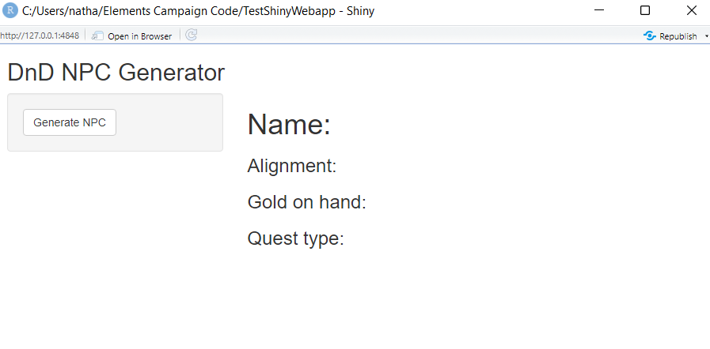

### Why Build a Web Application

Have you ever finished a long programming task, gotten excited over the result, and then
gone to show them to someone who doesn't know a whole lot about programming?

Did they get confused looking at the console output your showed them? Maybe I'm
in the minority here, but this has happened to me several times.

Not like I can blame them, nor do I blame you for not trying to assess what the following console output is, even if it
is just a sort.



When you take time to format code into a more readable webpage
and put it out there for people to see, people can get just as excited for your
code as you do. Plus, they can use it without you being right there! Suddenly, you can build
something for your friends to use or even simplify your own tasks. I'm currently building
a program to generate random characters for Dungeons and Dragons, which I'll use as an example.

In this tutorial, I'll show you how a sample R web application from your computer
onto the internet.

## Why Shiny

Putting your code out into the world for others to see can be a bit of a daunting
task. It adds a whole new layer of complexity to a problem you have realistically
already solved, and even if you've done it before, the whole affair can seem
more trouble than it's worth.

Thankfully, Shiny Webapps offers a solution. Shiny is a package, developed by
the same team as RStudio, that provides ready-to-go
tools for building a user interface and update that interface with new information programmatically. Shiny
also has a community website with free easy-to-use hosting for web applications built with Shiny.


### Getting started with Shiny

If you have RStudio installed, you can get started with Shiny right now.

You'll need to install two packages: shiny and rsconnect. The first one contains all the functions
you need to build a reactive app built in R. The second allows you to deploy
that code to [shinyapps.io](https://www.shinyapps.io).

Create a new project, and when you go to create your first file, select
Shiny Web App. Shiny is a framework developed by the RStudio team, so
support for the framework is built-in to RStudio by default.



Clicking on this option will bring up a dialog box. Give your application
a name and select "single file"



Basically, the Shiny framework requires you to define two things:
a ui object to handle the looks, and a server object to handle the data.

For now I'll give you a sample app.r and some functions I wrote
to make the page tick. As mentioned before, the app generates random fictional character info.
You can download the files needed from the links below or copy and paste from the code bubbles if downloading files
from some guy's blog makes you uncomfortable (which is valid!).


[app.r](https://drive.google.com/file/d/1eNkzzPRSAhfghCoviLT8bMj9JFOzRsf_/view?usp=sharing)
[npc_generate.r](https://drive.google.com/file/d/17ycHmn0Pg9FSlysiyBZ8Z_MuR1vTXC86/view?usp=sharing)

#app.r

```
library(shiny)
source("npc_generate.R")


ui <- fluidPage(

    titlePanel("DnD NPC Generator"),
    sidebarLayout(
        sidebarPanel(
            actionButton("build_npc", "Generate NPC")
        ),

        mainPanel(
           h1("Name:", textOutput("name")),
           h3("Alignment:", textOutput("align")),
           h3("Gold on hand:", textOutput("gold")),
           h3("Quest type: ", textOutput("quest"))
        )
    )
)

server <- function(input, output) {

    npc <- reactiveValues(data=NULL)
    
    observeEvent(input$build_npc, {
        npc$data <- build_npc()
        output$name <- renderText(npc$data$name)
        output$gold <- renderText(npc$data$gold)
        output$quest <- renderText(npc$data$quest_type)
        output$align <- renderText(npc$data$alignment)
    })
    
}

# Run the application 
shinyApp(ui = ui, server = server)
```


#npc_generate.r
```
library(httr)
library(jsonlite)

get_name <- function(){
  
  res <- GET("https://api.namefake.com")
  res <- fromJSON(rawToChar(res$content))
  return(res$name)
  
}

get_gold_amount <- function(average=15, std_dev=2){
  
  return(floor(rnorm(1, average, std_dev)))
         
}

get_quest_type <- function(quest_weights = NULL){
  
  types <- c("Fetch", "Escort", "Investigate", "Bounty", "Work")
  return(sample(types, 1, prob=quest_weights))
  
}

get_alignment <- function(law_weights = NULL, good_weights = NULL){
  
  law <- sample(c("Lawful", "Neutral", "Chaotic"), 1, prob=law_weights)
  good <- sample(c("Good", "Neutral", "Evil"), 1, prob=good_weights)
  
  if(law==good){
    return("True Neutral")
  }
  return(paste(law, good))
  
}

build_npc <- function(average=15, std_dev=2, quest_weights=NULL, law_weights=NULL, good_weights=NULL){
  
  return(list(
    name=get_name(),
    gold=get_gold_amount(average, std_dev),
    alignment=get_alignment(law_weights, good_weights),
    quest_type=get_quest_type(quest_weights)
  ))
  
}

```

_Bit of a side note:_ npc_generate is a file I had already written before
setting out to put it online. All the code was there, all I had to do
was put it all into self-contained functions.

Place these two files into your new project directory. Your file structure should look like this:



If you decide to make some changes and test things out, make sure app.js
remains in the root directory of your project, otherwise R files will be missing
when you put the code online.
Set your working directory to the folder with these two files and run
app.R. If everything worked you should see the following app:



Click on that Generate NPC button and those data fields will autofill
with information.

Let's get it on the web.

#Deploying with Shinyapps.io

The hard part is over! With a free account at [Shinyapps.io]("https://www.shinyapps.io/)
you can have up to 5 different applications online, with 25 hours per month of active usage.

Once you sign up for an account, Shinyapps will give you the instructions
to actually deploy an app, but I'll repeat them here.

Run the following the code in your R console, replacing file path with
the path to your folder containing app.R and the Xs with the value for token and secret you get from Shinyapps.
Make sure not to publish your secret, it is a secret after all.

```
rsconnect::setAccountInfo(name='mr-walls',
                           token='XXXXXXXX',
                           secret='XXXXXXX')
 
rsconnect::deployApp('../PATH_OF_PROJECT_FOLDER')
```

That's it! You're done! The second command should output the url
where you can view the application. You can delete the application from
the dashboard where you got your token and secret. My version, with updates in the future,
will remain live [here](https://mr-walls.shinyapps.io/testshinywebapp/) for the foreseeable future.

##Learning More

Ready for a deeper dive into how to develop an application?

Shiny has a large set of tutorials on how to build interactive user interfaces
and work with all kinds of data. You can find those [here](https://shiny.rstudio.com/tutorial/).

What do you want to build?
